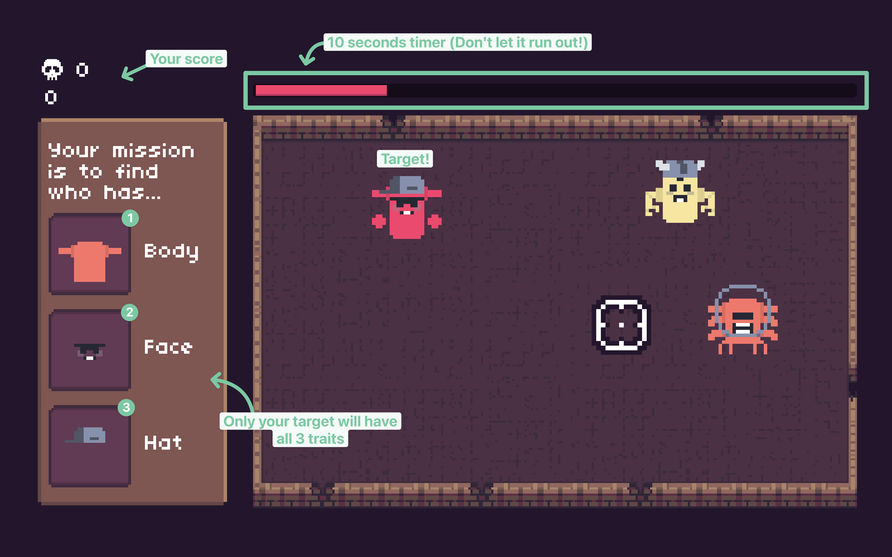

<div align="center">
<a href="https://rusty-hitman.mshl.me/" target="_blank">
    
</a>

Copyright © 2023 [Meshal Almutairi](mailto:meshal7@pdx.edu)

*CS 410P: Rust Programming Project*
</div>
<hr>


## Description

Rusty Hitman is a 2D game written in Rust using macroquad. Your mission is to find your target, among a crowd, before the time runs out. You must use the provided description to identify and eliminate your target by pointing and clicking on them.

- You have 10 seconds to identify and eliminate your target.
- Only your target will have all the provided traits. Don't shoot an innocent bystander!
- Beat your high score by eliminating as many targets as you can.


## Preview

<details open>
<summary>Click to expand screenshots</summary>

|  |  |  |
| :----------------------------------------------: | :----------------------------------------------: | :----------------------------------------------: |
|  |  |  |

</details>

For video presentation, see [PRESENTATION](PRESENTATION.mp4).


## Build and Run

To build the game, run the following command:

```
cargo build --release
```

To run the game, run the following command:

```
cargo run --release
```

> *Additionally, the game can be played in your browser at: https://rusty-hitman.mshl.me/*


## Testing

The game was continuously hand tested during development to ensure all components function as expected. The testing process involved verifying that the game mechanics, character spawning, timer, and score system worked correctly. There are no unit tests due to the nature of the project.


## Reflection

### What went well and what didn't

Overall, I'm pretty happy with how the project turned out. I was able to implement most of the features I wanted and the development process was a great learning experience. However, there is always room for improvement. I wanted to have the characters randomly wander around the level but I couldn't fully implement it due to time constraints. I also wanted to have better error handling instead of using `unwrap` but since the errors would only occur during development, I decided against it.

### Future improvements

- Make the characters randomly wander around the level area.
- Global leaderboard to track high scores.
- Add more game modes (Hard, Practice, etc.).


## License

This project is licensed under the MIT License. For more information, see the [LICENSE](LICENSE).

See [NOTICE](NOTICE.md) for used third-party assets.